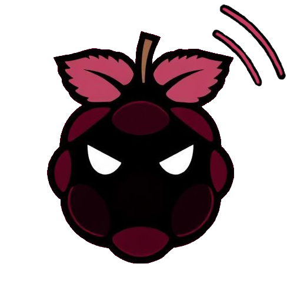

#  REDES 2024 
Emitidor de senial wifi y filtrador de mensajes.

## Requirements

### Windows
- Python 3.8 o superior
- Docker

### Unix
- Install Docker
```bash
chmod +x utilities/prerequisites/setup.sh
./utilities/prerequisites/setup.sh
```


## Installation

### Unix

- Crear Docker Image
```bash
chmod +x utilities/buildImage.sh
./utilities/buildImage.sh
```

### Windows

nose

## Execution

### Unix

- Crear Docker Image
```bash
chmod +x utilities/runImage.sh
./utilities/runImage.sh
```

### Windows

nose