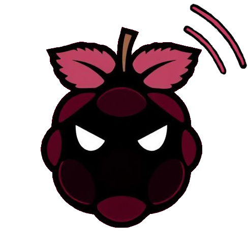

#  REDES 2024 
Emitidor de senial wifi y filtrador de mensajes.

##  Requirements

### Windows
- Docker

### Unix
- Install Docker
```bash
chmod +x docker/prerequisites/setupDocker.sh
./docker/prerequisites/setupDocker.sh
```


##  Installation

### Unix

#### Crear Docker Images del servidor

- Configuracion
```bash
chmod +x docker/*.sh
sudo ./docker/setup.sh
```

#### Crear Docker Images del cliente de prueba
- Configuracion
```bash
chmod +x client/docker/*.sh
sudo ./client/docker/setup.sh
```

### Windows

nose

##  Execution

### Unix

- Arrancar el servidor
```bash
# Dejar el container en ejecucion, 2do plano
sudo ./docker/start.sh

# Crear la base de datos en el container en ejecucion
sudo ./docker/startDB.sh

# Ejecutar el servidor dentro del container en ejecucion
sudo ./docker/run.sh
```
- Arrancar el container en mode explorador
```bash
# Permisos 'postgres'
sudo ./docker/explore.sh

# Permisos 'root'
sudo ./docker/exploreRoot.sh
```

- Arrancar el cliente de prueba
```bash
sudo ./client/docker/run.sh
```
- Arrancar el cliente de prueba en modo explorer
```bash
sudo ./client/docker/explorer.sh
```

### Windows

nose

##  Miscellaneous

### Unix

- Para ver todas las imagenes, volumenes, networks y containers actualmente ejecutandose en docker
```bash
sudo ./docker/check.sh
```

- Para eliminar instancias de docker
```bash
# Elimina toda instancia de docker que no este siendo utilizada
sudo ./docker/prune.sh

# Elimina el contenedor principal y el volumen de la base de datos para reiniciar ABSOLUTAMENTE todo.
sudo ./docker/deleteData.sh
```

- Para revisar la lista de comandos de docker revisar archivo "docker/commands.txt"